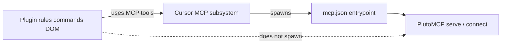

# Styx plugin spec (Phase 4 — complete)

## Goal

First-class Cursor integration: workflow rules, commands, click context delivery — not MCP config docs alone.

**Related:** [PlutoMCP architecture](./plutomcp-architecture.md) · [DOM bridge](./dom-bridge.md) · [Design Mode spike](../spikes/design-mode-hook.md)

**Click delivery:** **Design Mode** (D13) — validated in [spike-results.md](../spikes/spike-results.md). `dom_path` in hook prompt → MCP **`resolve_pluto_context`** → **`read_cell`**.

## Plugin structure

```
styx/                              # github.com/jowch/styx
  .cursor-plugin/plugin.json
  mcp.json                          # Cursor-managed MCP entrypoint
  Project.toml                      # Plugin-owned Julia env (root)
  Manifest.toml                     # generated on first launch
  scripts/
    ensure-julia-env.sh             # bootstrap Julia env on first launch
    pluto-mcp-launcher.sh           # ensure bridge + stdio proxy (primary)
  commands/
    pluto-select-cell.md            # parse dom_path or @pluto-context fallback (intent=read)
    pluto-edit-cell.md              # intent=edit
    pluto-explain-cell.md           # intent=explain
  rules/
    pluto-notebook-workflow.mdc     # stage → submit_changes; one-expression cells
  docs/
    pluto-agent-primer.md           # Agent training (browser-first, errors, staging)
    pluto-semantics.md              # Cell grammar reference
  hooks/
    hooks.json                      # MCP health gate; edit guard (H4)
    pluto_lib.py                    # parse_dom_path helpers
    session-start.sh                # static MCP workflow context
  README.md
```

**Install:** `~/.cursor/plugins/local/styx/` via `./scripts/sync-local-plugin.sh`

## Component responsibilities

| Component | Role |
|-----------|------|
| `rules/pluto-notebook-workflow.mdc` | Always-on: stage-first, `submit_changes`, read before edit, Design Mode → **`resolve_pluto_context`** |
| `hooks/` | MCP health gate on Design Mode prompts; `preToolUse` / `beforeMCPExecution` edit guard (H4) |
| `commands/pluto-*-cell` | Intent commands with manual ID / `@pluto-context` fallback |
| `hooks/sessionStart` | Optional: inject static workflow via `additional_context` |
| `mcp.json` | Declares MCP entrypoint; **Cursor spawns it** (see MCP lifecycle) |
| `scripts/pluto-mcp-launcher.sh` | Bootstraps plugin-root Julia env, ensures bridge healthy, then exec stdio proxy |
| PlutoMCP `resolve_pluto_context` | Canonical server-side parser for Design Mode `dom_path` / browser blocks |

---

## MCP lifecycle (D12)

Three layers — do not collapse them:



| Layer | Owns lifecycle? |
|-------|-------------------|
| **Cursor** | Spawns stdio MCP from `mcp.json`; connects to HTTP URLs |
| **PlutoMCP** | `serve()` session, tools, `/health` |
| **Plugin** | Rules, hooks, commands — **not** Julia process supervision |

This matches other plugins (e.g. Browse): plugin ships `mcp.json`, Cursor starts the MCP process, plugin never shells out to start/stop it from commands.

### Primary: stdio launcher (recommended)

```json
{
  "mcpServers": {
    "pluto": {
      "command": "${CURSOR_PLUGIN_ROOT}/scripts/pluto-mcp-launcher.sh",
      "cwd": "${CURSOR_PLUGIN_ROOT}"
    }
  }
}
```

**Launcher behavior:**
0. Run `ensure-julia-env.sh` — bootstrap plugin-root env (local `Pkg.develop` or git add on first run)
1. `GET http://127.0.0.1:2346/health` — if OK, skip to step 3
2. If down: spawn `julia --project=. -e 'using PlutoMCP; PlutoMCP.serve(...)'` in background; poll `/health` until ready
3. `exec julia --project=. -e 'using PlutoMCP; PlutoMCP.connect()'` — stdio proxy to live bridge

Cursor spawns the launcher; launcher delegates to PlutoMCP; plugin commands do not.

**Fork follow-up (optional):** `PlutoMCP.ensure_serve()` to consolidate steps 1–2 inside Julia instead of shell script.

### Alternative: HTTP URL (power users)

```json
{
  "mcpServers": {
    "pluto": { "url": "http://localhost:2346/sse" }
  }
}
```

User runs `serve()` manually in a terminal. Cursor connects only; no auto-start. Useful when keeping a long-lived Pluto session open across Cursor restarts.

### Why not standalone `connect()` alone?

Standalone mode lazy-starts an **isolated** Pluto session — not the browser tab from a separate `serve()`. Wrong for click-bridge. Proxy mode (step 3 above) attaches to the shared session. See [plutomcp-architecture.md § entry modes](./plutomcp-architecture.md#three-entry-modes).

### Plugin UX when bridge is down

| Do | Don't |
|----|-------|
| Ship working `mcp.json` + launcher | Spawn Julia from command markdown |
| Optional `beforeMCPExecution` hook: friendly error if `/health` fails | Compete with Cursor's MCP restart logic |
| Rule: "notebooks must be opened in serve() session at localhost:1234" | Plugin-owned long-lived Julia REPL |

**Auth:** Pluto default (`require_secret_for_access=true`). Plugin launcher passes `require_secret_for_access=false` on loopback (D14) so Glass opens at `http://localhost:1234/` without `?secret=` (sets auth cookie; `/edit` URLs still need that cookie while `require_secret_for_open_links` is true). Supported: local machine or SSH port-forward to loopback.

---

## Context injection format

**Decision:** Path A (Design Mode) is primary; commands format the block for chat when needed.

```
@pluto-context
notebook_id: ...
cell_id: ...
intent: edit
in_output: true
---
User selected this cell. read_cell for detail; read_notebook_code for full context.
Stage edits with edit_cell (run_after=false); submit_changes when ready.
```

**Path A flow (production):**
1. User toggles Design Mode (**Cmd+Shift+D**) in Agents Glass, clicks a cell
2. Hook receives `dom_path` in `prompt`; agent calls MCP **`resolve_pluto_context`**
3. Agent calls **`read_cell`** with resolved IDs

**Fallback:** `@pluto-context` command with manual IDs.

---

## Intent UX (D11)

Intent set by command choice:

| Command | `intent` |
|---------|----------|
| `pluto-select-cell` | `read` |
| `pluto-edit-cell` | `edit` |
| `pluto-explain-cell` | `explain` |

---

## Phased plugin delivery

### Phase 4a — MVP (no click automation)

- Workflow rule + `mcp.json` with launcher
- Commands accept manual `cell_id` / `notebook_id` (positive-control path; see spike Test D)
- Validates MCP workflow before click automation

### Phase 4b — Click context *(D13: Path A)*

**Chosen:** Glass Design Mode → `browser_element` / `dom_path` in prompt (hook-visible) → `resolve_pluto_context` or parse `pluto-cell#` / `pluto-notebook#` → MCP `read_cell`; `preToolUse` / `beforeMCPExecution` edit guard.

**Fallback:** `@pluto-context` command for manual IDs.

Spike: [spike-results.md](../spikes/spike-results.md).

### Phase 4c — Production polish *(D13)*

Design Mode rule text; optional screenshot handling; `resolve_pluto_context` MCP tool. No inject+queue as primary unless H1 manual follow-up changes D13.

---

## What the plugin does NOT do

- **Supervise Julia/MCP processes** from rules or commands (Cursor + `mcp.json` + PlutoMCP own this)
- Implement MCP tools (fork)
- Bundle Browse MCP (agent-automation in separate browser; wrong for live Pluto tab)

---

## End-to-end workflow

```
Cursor activates plugin
  → spawns pluto-mcp-launcher.sh (mcp.json)
  → launcher ensures serve() bridge on :2346
  → connect() stdio proxy attaches
User opens notebook in Agents Glass (serve() session, localhost:1234)
User toggles Design Mode (Cmd+Shift+D), clicks cell → dom_path in hook prompt
Plugin parses pluto-cell# → @pluto-context in chat (or agent reads from hook context)
Agent → MCP tools → in-process Notebook mutation → browser syncs via WebSocket
```

---

## Acceptance

- Install plugin; MCP auto-wires via `mcp.json` (no manual Cursor MCP config beyond plugin install)
- Notebook open in `serve()` Pluto UI; agent edits via MCP; browser updates live
- Phase 4b: Design Mode click → context in chat → edit without UUID paste
