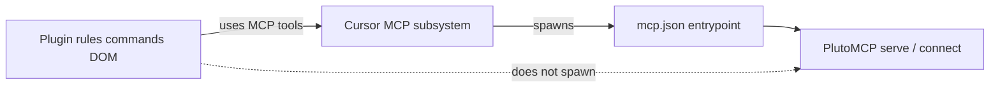

# Cursor Plugin Spec — Phase 4

## Goal

First-class Cursor integration: workflow rules, commands, click context delivery — not MCP config docs alone.

**Related:** [PlutoMCP architecture](./plutomcp-architecture.md) · [DOM bridge](./dom-bridge.md)

## Plugin structure

```
pluto-cursor-bridge/
  .cursor-plugin/plugin.json
  mcp.json                          # Cursor-managed MCP entrypoint
  scripts/
    pluto-mcp-launcher.sh           # ensure bridge + stdio proxy (primary)
  commands/
    pluto-select-cell.md            # read queue → inject context (intent=read)
    pluto-edit-cell.md              # intent=edit
    pluto-explain-cell.md           # intent=explain
  rules/
    pluto-notebook-workflow.mdc     # stage → submit_changes
  hooks/
    hooks.json                      # optional sessionStart bootstrap
    session-start.sh                # static MCP workflow context
  src/
    dom-resolver.js                 # shared with Phase 3
    inject.js
  bridge/
    server.js                       # local click queue (~/.cursor/.../pluto-click.json)
  README.md
```

**Install:** `~/.cursor/plugins/local/pluto-cursor-bridge/`

## Component responsibilities

| Component | Role |
|-----------|------|
| `rules/pluto-notebook-workflow.mdc` | Always-on: stage-first, `submit_changes`, read before edit, draft-buffer warning |
| `commands/pluto-*-cell` | Read click queue → format `@pluto-context` block into chat |
| `hooks/sessionStart` | Optional: inject static workflow via `additional_context` |
| `mcp.json` | Declares MCP entrypoint; **Cursor spawns it** (see MCP lifecycle) |
| `scripts/pluto-mcp-launcher.sh` | Ensures bridge healthy, then exec stdio proxy |
| `bridge/server.js` | Click packet queue (plugin-owned, separate from MCP) |
| `src/dom-resolver.js` | Posts clicks to queue |

---

## MCP lifecycle (D12)

Three layers — do not collapse them:



| Layer | Owns lifecycle? |
|-------|-------------------|
| **Cursor** | Spawns stdio MCP from `mcp.json`; connects to HTTP URLs |
| **PlutoMCP** | `serve()` session, tools, `/health` |
| **Plugin** | Rules, commands, click queue — **not** Julia process supervision |

This matches other plugins (e.g. Browse): plugin ships `mcp.json`, Cursor starts the MCP process, plugin never shells out to start/stop it from commands.

### Primary: stdio launcher (recommended)

```json
{
  "mcpServers": {
    "pluto": {
      "command": "${CURSOR_PLUGIN_ROOT}/scripts/pluto-mcp-launcher.sh",
      "cwd": "${CURSOR_PLUGIN_ROOT}"
    }
  }
}
```

**Launcher behavior (planned):**
1. `GET http://127.0.0.1:2346/health` — if OK, skip to step 3
2. If down: spawn `julia -e 'using PlutoMCP; PlutoMCP.serve(launch_browser=true)'` in background; poll `/health` until ready
3. `exec julia -e 'using PlutoMCP; PlutoMCP.connect()'` — stdio proxy to live bridge

Cursor spawns the launcher; launcher delegates to PlutoMCP; plugin commands do not.

**Fork follow-up (optional):** `PlutoMCP.ensure_serve()` to consolidate steps 1–2 inside Julia instead of shell script.

### Alternative: HTTP URL (power users)

```json
{
  "mcpServers": {
    "pluto": { "url": "http://localhost:2346/sse" }
  }
}
```

User runs `serve()` manually in a terminal. Cursor connects only; no auto-start. Useful when keeping a long-lived Pluto session open across Cursor restarts.

### Why not standalone `connect()` alone?

Standalone mode lazy-starts an **isolated** Pluto session — not the browser tab from a separate `serve()`. Wrong for click-bridge. Proxy mode (step 3 above) attaches to the shared session. See [plutomcp-architecture.md § entry modes](./plutomcp-architecture.md#three-entry-modes).

### Plugin UX when bridge is down

| Do | Don't |
|----|-------|
| Ship working `mcp.json` + launcher | Spawn Julia from command markdown |
| Optional `beforeMCPExecution` hook: friendly error if `/health` fails | Compete with Cursor's MCP restart logic |
| Rule: "notebooks must be opened in serve() session at localhost:1234" | Plugin-owned long-lived Julia REPL |

---

## Context injection format

**Decision:** Commands are primary delivery mechanism for MVP.

```
@pluto-context
notebook_id: ...
cell_id: ...
intent: edit
in_output: true
---
User selected this cell. read_cell for detail; read_notebook_code for full context.
Stage edits with edit_cell (run_after=false); submit_changes when ready.
```

Flow:
1. User activates inject script once per Pluto tab
2. User clicks cell → packet queued locally
3. User runs command → chat prefilled with block above
4. Agent follows rule → MCP tools

---

## Intent UX (D11)

Intent set by command choice:

| Command | `intent` |
|---------|----------|
| `pluto-select-cell` | `read` |
| `pluto-edit-cell` | `edit` |
| `pluto-explain-cell` | `explain` |

---

## Phased plugin delivery

### Phase 4a — MVP (no DOM inject)

- Workflow rule + `mcp.json` with launcher
- Commands accept manual `cell_id` / `notebook_id`
- Validates MCP workflow before click automation

### Phase 4b — Click queue

- `dom-resolver.js` + `bridge/server.js`
- Commands read queue

### Phase 4c — Production inject

- One-click inject activation
- Optional screenshot for figure targets

---

## What the plugin does NOT do

- **Supervise Julia/MCP processes** from rules or commands (Cursor + `mcp.json` + PlutoMCP own this)
- Implement MCP tools (fork)
- Bundle Browse MCP (agent-automation in separate browser; wrong for live Pluto tab)

---

## End-to-end workflow

```
Cursor activates plugin
  → spawns pluto-mcp-launcher.sh (mcp.json)
  → launcher ensures serve() bridge on :2346
  → connect() stdio proxy attaches
User opens notebook at localhost:1234 (serve() session)
User clicks cell → dom-resolver → click queue
User runs pluto-edit-cell command → @pluto-context in chat
Agent → MCP tools → in-process Notebook mutation → browser syncs via WebSocket
```

---

## Acceptance

- Install plugin; MCP auto-wires via `mcp.json` (no manual Cursor MCP config beyond plugin install)
- Notebook open in `serve()` Pluto UI; agent edits via MCP; browser updates live
- Phase 4b: click → command → edit without UUID paste
