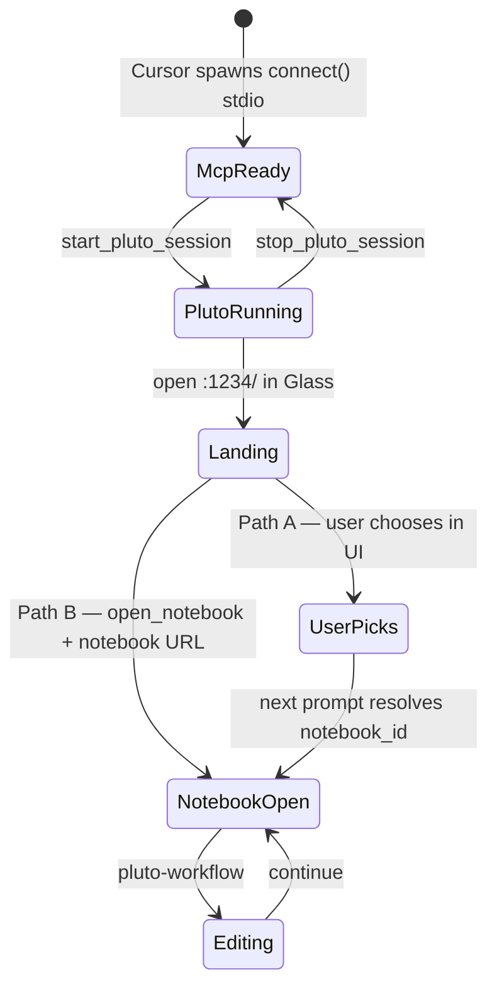

# Pluto session lifecycle (D15)

> **Status:** Spec — baseline for 0.1.0. Implementation split: PlutoMCP.jl (lifecycle tools) + Styx (skill, launcher, hooks).

## Problem

Styx users are Cursor users first. They may write Julia outside Pluto. Pluto should spin up **only when notebook work is requested**, without manual shell scripts — the **agent** handles setup.

Installing Styx + enabling the **pluto** MCP server must **not** commit to a full Pluto process in the background until needed.

## Decision summary (D15)

| Principle | Choice |
|-----------|--------|
| Default model | **Lazy warm (Option C)** — MCP stdio always up; Pluto starts on notebook intent |
| Who starts Pluto | **Agent** via MCP lifecycle tools — not user shell scripts |
| No specific notebook | **Path A** — landing page only; user picks in Pluto UI; agent resolves `notebook_id` on **next** prompt |
| Specific notebook named | **Path B** — landing page (cookies) → `open_notebook` → notebook URL in Glass |
| Notebook on disk | **Never** auto-open; Path B only when user names the path |
| Auto-serve on MCP connect | **Off** by default; optional `PLUTOMCP_AUTO_SERVE=1` for power users |
| After notebook is open | Design Mode click path (D13) for cell-level work |

---

## Architecture



### Bootstrap paths

| Path | User intent | Agent does | User does |
|------|-------------|------------|-----------|
| **A** | "Work on notebooks" (no file named) | `start_pluto_session` → open `http://127.0.0.1:1234/` | Pick/create notebook in Pluto UI |
| **B** | Names a specific notebook path | `start_pluto_session` → landing URL → `open_notebook` → notebook URL | Lands directly in that notebook |

**Path A follow-up:** On the **next prompt**, agent resolves `notebook_id` (Design Mode click, Glass URL, `list_notebooks`) — not during bootstrap.

**Path B cookie step:** Open landing page before notebook URL so loopback auth cookies are set (D14).

### Process layers

| Layer | Always on? | Cost |
|-------|------------|------|
| Styx plugin (rules, hooks, skills) | When plugin enabled | ~none |
| MCP stdio (`connect()` standalone) | When **pluto** MCP enabled | Small (Julia, no Pluto) |
| Pluto session (`Pluto.run!`) | Only after `start_pluto_session` | Large |

### Launcher change (Styx)

`mcp.json` spawns **standalone `connect()`** only. No HTTP bridge prerequisite. No auto-`serve()` in shell.

```bash
# Target launcher behavior
julia --project=$PLUGIN_ROOT -e 'using PlutoMCP; PlutoMCP.connect(...)'
# → stdio MCP up immediately
# → Pluto NOT started until start_pluto_session
```

`scripts/pluto-serve.sh` remains for dev/debug; **not** user-facing.

---

## PlutoMCP changes (fork)

### New lifecycle tools

| Tool | Purpose |
|------|---------|
| `pluto_session_status` | `{pluto: "stopped"\|"running", pluto_port, notebooks: [...]}` |
| `start_pluto_session` | Start `Pluto.run!` in-process if stopped; idempotent |
| `stop_pluto_session` | Graceful shutdown; optional for 0.1.0 |
| `open_notebook` | Load a user-confirmed `.jl` path into the session; see [open_notebook semantics](#open_notebook-semantics) |

### `open_notebook` semantics

Loads a notebook **server-side** so MCP tools and Glass share the same session. The user never sees the tool name — Path B ends with Glass on `http://127.0.0.1:1234/edit?id=<notebook_id>`.

**Pluto API:** `Pluto.SessionActions.open(session, path; …)`

| Parameter | Default | Behavior |
|-----------|---------|----------|
| `path` | required | User-confirmed filesystem path |
| `run_notebook` | `false` | Match modern Pluto UI: **safe preview**, blue "Run notebook" banner, cells not executed |

**Default (`run_notebook=false`):** `execution_allowed=false` — same as opening manually from the landing page. Notebook is visible and editable; execution waits for explicit opt-in.

**When `run_notebook=true`:** User asked to open **and run** (or agent confirmed for expensive notebooks). Programmatic equivalent of clicking "Run notebook" — implement via `execution_allowed=true` and/or `run_all_cells` after open.

**Do not** auto-run on Path B unless the user requested it. For staged agent edits after open, use normal **pluto-workflow** (`edit_cell` → `submit_changes`), not `run_all_cells`.

**Safe preview exit:** `allow_execution(notebook_id=…)` — Glass **Run notebook code** equivalent; optional `run_notebook` (default true). If the tool is not in the MCP picker, invoke by name. On risky remote sources, Glass UI may still be required. **Remind** the user in safe preview that outputs/widgets won't update until execution is allowed — still edit when asked.

### Behavior changes

1. **Standalone `connect()`** — `tools/call` that needs a session returns structured error `pluto_not_running` with hint to call `start_pluto_session` (no silent lazy-start on first tool).
2. **`initialize` / `tools/list` / `pluto_session_status`** — work without Pluto running.
3. **`open_notebook`** — `SessionActions.open` with `execution_allowed=false` by default (safe preview). Optional `run_notebook=true` for explicit run. User-confirmed path only.
4. **Existing notebooks on disk** — never opened automatically. Path B only when the user names a path. Path A defers choice to Pluto's landing UI.

### Glass navigation (both paths)

| Step | URL | When |
|------|-----|------|
| Landing | `http://127.0.0.1:1234/` | Always after `start_pluto_session`; Path A stops here |
| Notebook | `http://127.0.0.1:1234/edit?id=<notebook_id>` | Path B after `open_notebook`; Path A only on a later prompt once id is known |

Use **`cursor-ide-browser`** → `browser_navigate` (`position: "active"`). Path B: landing → `open_notebook` → `browser_click` notebook on landing (not pasted `/edit?id=`).

### Optional env

| Variable | Default | Effect |
|----------|---------|--------|
| `PLUTOMCP_AUTO_SERVE` | `0` | `1` = legacy auto-start Pluto when MCP connects |

---

## Styx plugin changes

| Item | Change |
|------|--------|
| `mcp.json` / launcher | Standalone `connect()` only |
| `skills/pluto-session/SKILL.md` | **New** — agent bootstrap playbook |
| `skills/pluto-workflow/SKILL.md` | Editing once notebook is open; references pluto-session |
| `rules/pluto-notebook-workflow.mdc` | Short: defer to skills; no shell scripts |
| `commands/pluto-notebooks.md` | **New** — user says "work on notebooks" |
| `commands/pluto-start.md` | **Remove** or redirect to pluto-notebooks |
| `hooks/check-design-mode.py` | Gate on `pluto_session_status` / running, not raw `/health` alone |

### Glass navigation

Agent opens Pluto in **Agents Glass** via **`cursor-ide-browser`**:

1. `browser_navigate({ url: "http://127.0.0.1:1234/", position: "active" })` — confirm `glass-browser-*` view ID
2. **Path B:** after `open_notebook`, `browser_click` notebook filename on landing — not cold `/edit?id=`

Do **not** use `plugin-browse-browser` for Pluto.

---

## Acceptance (0.1.0)

Automated: `Pkg.test()` (PlutoMCP), `eval/run_reference.jl --all --strict-trace` (Styx), `scripts/validate-pluto-lifecycle.sh` (lifecycle; preflight with `--require-ports-free`).

Manual Path A/B + Design Mode: see **pluto-session** / **pluto-workflow** skills. Signed off 2026-06-18.

---

## Related

- [D15 in DECISIONS.md](../DECISIONS.md)
- [Path B loading hang](../known-issues/path-b-edit-url-loading.md)
- MCP tool semantics: [PlutoMCP.jl AGENTS.md](https://github.com/jowch/PlutoMCP.jl/blob/main/AGENTS.md)
