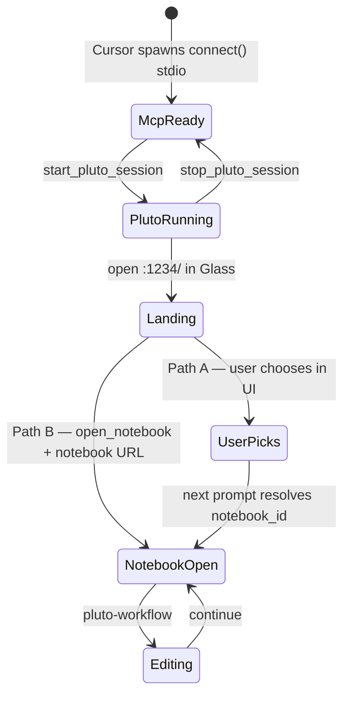

# Pluto session lifecycle (D15)

> **Status:** Spec — baseline for 0.1.0. Implementation split: PlutoMCP.jl (lifecycle tools) + Styx (skill, launcher, hooks).

## Problem

Styx users are Cursor users first. They may write Julia outside Pluto. Pluto should spin up **only when notebook work is requested**, without manual shell scripts — the **agent** handles setup.

Installing Styx + enabling the **pluto** MCP server must **not** commit to a full Pluto process in the background until needed.

## Decision summary (D15)

| Principle | Choice |
|-----------|--------|
| Default model | **Lazy warm (Option C)** — MCP stdio always up; Pluto starts on notebook intent |
| Who starts Pluto | **Agent** via MCP lifecycle tools — not user shell scripts |
| No specific notebook | **Path A** — landing page only; user picks in Pluto UI; agent resolves `notebook_id` on **next** prompt |
| Specific notebook named | **Path B** — landing page (cookies) → `open_notebook` → notebook URL in Glass |
| Notebook on disk | **Never** auto-open; Path B only when user names the path |
| Auto-serve on MCP connect | **Off** by default; optional `PLUTOMCP_AUTO_SERVE=1` for power users |
| After notebook is open | Design Mode click path (D13) for cell-level work |

---

## Architecture



### Bootstrap paths

| Path | User intent | Agent does | User does |
|------|-------------|------------|-----------|
| **A** | "Work on notebooks" (no file named) | `start_pluto_session` → open `http://127.0.0.1:1234/` | Pick/create notebook in Pluto UI |
| **B** | Names a specific notebook path | `start_pluto_session` → landing URL → `open_notebook` → notebook URL | Lands directly in that notebook |

**Path A follow-up:** On the **next prompt**, agent resolves `notebook_id` (Design Mode click, Glass URL, `list_notebooks`) — not during bootstrap.

**Path B cookie step:** Open landing page before notebook URL so loopback auth cookies are set (D14).

### Process layers

| Layer | Always on? | Cost |
|-------|------------|------|
| Styx plugin (rules, hooks, skills) | When plugin enabled | ~none |
| MCP stdio (`connect()` standalone) | When **pluto** MCP enabled | Small (Julia, no Pluto) |
| Pluto session (`Pluto.run!`) | Only after `start_pluto_session` | Large |

### Launcher change (Styx)

`mcp.json` spawns **standalone `connect()`** only. No HTTP bridge prerequisite. No auto-`serve()` in shell.

```bash
# Target launcher behavior
julia --project=$PLUGIN_ROOT -e 'using PlutoMCP; PlutoMCP.connect(...)'
# → stdio MCP up immediately
# → Pluto NOT started until start_pluto_session
```

`scripts/pluto-serve.sh` remains for dev/debug; **not** user-facing.

---

## PlutoMCP changes (fork)

### New lifecycle tools

| Tool | Purpose |
|------|---------|
| `pluto_session_status` | `{pluto: "stopped"\|"running", pluto_port, notebooks: [...]}` |
| `start_pluto_session` | Start `Pluto.run!` in-process if stopped; idempotent |
| `stop_pluto_session` | Graceful shutdown; optional for 0.1.0 |
| `open_notebook` | Load a user-confirmed `.jl` path into the session; see [open_notebook semantics](#open_notebook-semantics) |

### `open_notebook` semantics

Loads a notebook **server-side** so MCP tools and Glass share the same session. The user never sees the tool name — Path B ends with Glass on `http://127.0.0.1:1234/<notebook_id>`.

**Pluto API:** `Pluto.SessionActions.open(session, path; …)`

| Parameter | Default | Behavior |
|-----------|---------|----------|
| `path` | required | User-confirmed filesystem path |
| `run_notebook` | `false` | Match modern Pluto UI: **safe preview**, blue "Run notebook" banner, cells not executed |

**Default (`run_notebook=false`):** `execution_allowed=false` — same as opening manually from the landing page. Notebook is visible and editable; execution waits for explicit opt-in.

**When `run_notebook=true`:** User asked to open **and run** (or agent confirmed for expensive notebooks). Programmatic equivalent of clicking "Run notebook" — implement via `execution_allowed=true` and/or `run_all_cells` after open.

**Do not** auto-run on Path B unless the user requested it. For staged agent edits after open, use normal **pluto-workflow** (`edit_cell` → `submit_changes`), not `run_all_cells`.

**Agent cannot exit safe preview via MCP** (no `allow_execution` tool yet). **Remind** the user that the notebook is in preview mode and that staged edits won't run / outputs won't update until they click **Run notebook code** in Glass — still edit when asked. If they ask the agent to run, direct them to that button (not `run_all_cells`).

### Behavior changes

1. **Standalone `connect()`** — `tools/call` that needs a session returns structured error `pluto_not_running` with hint to call `start_pluto_session` (no silent lazy-start on first tool).
2. **`initialize` / `tools/list` / `pluto_session_status`** — work without Pluto running.
3. **`open_notebook`** — `SessionActions.open` with `execution_allowed=false` by default (safe preview). Optional `run_notebook=true` for explicit run. User-confirmed path only.
4. **Existing notebooks on disk** — never opened automatically. Path B only when the user names a path. Path A defers choice to Pluto's landing UI.

### Glass navigation (both paths)

| Step | URL | When |
|------|-----|------|
| Landing | `http://127.0.0.1:1234/` | Always after `start_pluto_session`; Path A stops here |
| Notebook | `http://127.0.0.1:1234/<notebook_id>` | Path B after `open_notebook`; Path A only on a later prompt once id is known |

Use `open_resource` in Agents Glass. Path B: **landing first**, then notebook (cookie setup).

### Optional env

| Variable | Default | Effect |
|----------|---------|--------|
| `PLUTOMCP_AUTO_SERVE` | `0` | `1` = legacy auto-start Pluto when MCP connects |

---

## Styx plugin changes

| Item | Change |
|------|--------|
| `mcp.json` / launcher | Standalone `connect()` only |
| `skills/pluto-session/SKILL.md` | **New** — agent bootstrap playbook |
| `skills/pluto-workflow/SKILL.md` | Editing once notebook is open; references pluto-session |
| `rules/pluto-notebook-workflow.mdc` | Short: defer to skills; no shell scripts |
| `commands/pluto-notebooks.md` | **New** — user says "work on notebooks" |
| `commands/pluto-start.md` | **Remove** or redirect to pluto-notebooks |
| `hooks/check-design-mode.py` | Gate on `pluto_session_status` / running, not raw `/health` alone |
| `eval/PLUTO_WORKFLOW_PREFIX.md` | Point to pluto-session skill |

### Glass navigation

Agent opens Pluto in **Agents Glass** via `open_resource` (cursor-app-control MCP) when available:

- Home: `http://127.0.0.1:1234/`
- Notebook: `http://127.0.0.1:1234/<notebook_id>`

Do not use `cursor-ide-browser` MCP for Pluto (D13).

---

## Simulated user experience

### Scenario A — General intent (landing page only)

**User:** "I want to work on my Pluto notebooks"

| Step | Actor | What happens |
|------|-------|--------------|
| 1 | Agent | **pluto-session** Path A |
| 2 | Agent | `start_pluto_session` |
| 3 | Agent | Opens `http://127.0.0.1:1234/` in Agents Glass |
| 4 | Agent | Short message: pick a notebook on this page; next message can be a cell click or request |
| 5 | User | Clicks a notebook in Pluto UI, explores, maybe runs cells |
| 6 | User | *Next prompt:* ⌘⇧D, clicks cell — "fix the labels" |
| 7 | Agent | **pluto-workflow** — `resolve_pluto_context` → `read_cell` → edit |

Agent does **not** ask which notebook in chat. Notebook id comes from the **second** prompt.

---

### Scenario B — Specific notebook

**User:** "Open `experiments/odes.jl` in Pluto"

| Step | Actor | What happens |
|------|-------|--------------|
| 1 | Agent | **pluto-session** Path B |
| 2 | Agent | `start_pluto_session` |
| 3 | Agent | Opens `http://127.0.0.1:1234/` in Glass *(cookies)* |
| 4 | Agent | `open_notebook(path=…)` → `notebook_id` *(safe preview; run banner unless `run_notebook=true`)* |
| 5 | Agent | Opens `http://127.0.0.1:1234/<notebook_id>` in Glass |
| 6 | User | Sees notebook directly; edits via Design Mode or chat |

---

### Scenario C — Notebook already open in session

**Context:** Pluto running; `list_notebooks` returns one notebook.

| Step | Actor | What happens |
|------|-------|--------------|
| 1 | User | "Add a summary cell at the end" |
| 2 | Agent | `pluto_session_status` → running; `list_notebooks` or Design Mode click |
| 3 | Agent | Skips start/open; goes straight to **pluto-workflow** edit path |

No re-prompt for notebook unless ambiguous.

---

### Scenario D — User only writing non-Pluto Julia

**Context:** Same Cursor session, pluto MCP enabled (stdio idle).

| Step | Actor | What happens |
|------|-------|--------------|
| 1 | User | Edits `src/foo.jl` in normal editor, asks agent about package code |
| 2 | Agent | Does **not** call `start_pluto_session`; no Pluto tools |
| 3 | — | No Pluto process; only lightweight MCP stdio |

---

### Scenario E — `.jl` on disk is not auto-loaded

**Context:** Repo contains `notebooks/demo.jl`; user has not asked about notebooks.

Agent does **not** call `open_notebook` until user names a path (Path B) or picks from landing UI (Path A).

---

### Scenario F — Done with notebooks (optional)

| Step | Actor | What happens |
|------|-------|--------------|
| 1 | User | "I'm done with notebooks for now" |
| 2 | Agent | `submit_changes` if `pending_run`; optional `stop_pluto_session` |
| 3 | — | Pluto stops; MCP stdio stays up for next request |

---

## Acceptance (0.1.0)

Automated gates: `Pkg.test()` (PlutoMCP), `eval/run_reference.jl --all --strict-trace` (Styx).

**Manual walkthrough:** [d15-lifecycle-manual-checklist.md](../d15-lifecycle-manual-checklist.md) — Path A/B in Glass + Design Mode. Preflight: `./scripts/d15-preflight.sh`.

**Signed off:** 2026-06-18 — Path A follow-up (Design Mode → `resolve_pluto_context` → edit, plot notebook) and Path B (`reactive_xy.jl` safe preview + slider edit) validated in live Glass session.

- [x] MCP connects without Pluto running (Cursor shows pluto MCP healthy for handshake)
- [x] User can say "work on notebooks" with zero shell commands
- [x] Agent starts Pluto via `start_pluto_session`
- [x] Path A: landing page only; no chat prompt for which notebook
- [x] Path B: landing → `open_notebook` → notebook URL in Glass
- [x] `open_notebook`: safe preview by default; `run_notebook` opt-in
- [x] Next prompt after Path A resolves `notebook_id` via Design Mode / URL
- [x] Design Mode click → edit works on opened notebook
- [x] Ordinary Julia work does not start Pluto
- [x] **pluto-session** skill documents full bootstrap playbook

---

## Implementation order

1. **PlutoMCP:** `pluto_session_status`, `start_pluto_session`, deferred session in `connect()`
2. **PlutoMCP:** `open_notebook`
3. **Styx:** launcher → standalone `connect()`
4. **Styx:** `pluto-session` skill + `pluto-notebooks` command
5. **Styx:** hook updates, remove user-facing `pluto-start`
6. **Eval:** scenario for lifecycle bootstrap (optional)

---

## Related

- [D15 in DECISIONS.md](../DECISIONS.md)
- [plutomcp-architecture.md](./plutomcp-architecture.md) — entry modes (amend after D15 ships)
- [cursor-plugin.md](./cursor-plugin.md) — MCP lifecycle (amend § launcher)
