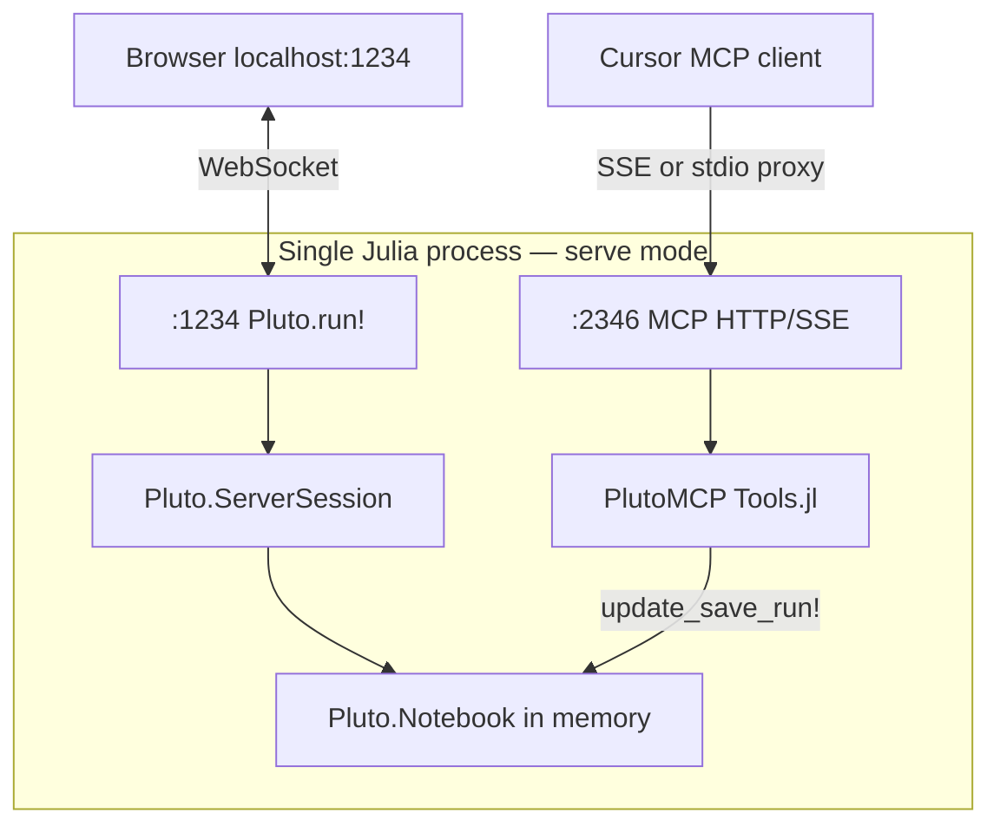

# PlutoMCP.jl — Internal Architecture

> Staging doc describing how the fork works today. Implementation lives in [PlutoMCP.jl](https://github.com/jowch/PlutoMCP.jl).

## Summary

PlutoMCP is a **thin MCP transport layer** on top of a normal **Pluto server session**. It does not implement a custom notebook UI or a headless Pluto mode. When Pluto starts, you get the **full Pluto frontend** (HTTP + WebSocket + static assets).

---

## One Julia process, two HTTP servers

`PlutoMCP.serve()` starts both:

| Server | Default port | Started by | Purpose |
|--------|--------------|------------|---------|
| **Pluto** (`Pluto.run!`) | `:1234` | `serve()` / standalone `connect()` | Full Pluto app: UI, notebooks, reactivity |
| **MCP bridge** | `:2346` | `serve()` only | MCP protocol: `/sse`, `/message`, `/call`, `/health` |



`serve()` blocks on the MCP HTTP server. The Pluto server runs in a background task (`@async Pluto.run!`).

---

## Does it spin up the full frontend?

**Yes.** `Pluto.run!` always starts the complete Pluto stack — frontend assets, notebook HTTP server, reactive scheduler, WebSocket push. PlutoMCP adds MCP endpoints; it does not replace or strip the UI.

What varies is **auto-open browser**:

| Entry | `Pluto.run!` | Auto-open browser |
|-------|--------------|-------------------|
| `serve()` | Immediately | Yes (default `launch_browser=true`) |
| `connect()` standalone | Lazy on first `tools/call` | No (`launch_browser=false`) |
| `connect()` proxy | Uses existing `serve()` session | Whatever `serve()` did |

Standalone `connect()` still serves the full UI at `http://localhost:1234` — you can open it manually — but Julia won't launch a browser window.

---

## How tool calls mutate notebooks

MCP tools operate **in-process** on live `Pluto.Notebook` objects:

1. MCP client sends JSON-RPC `tools/call`
2. `MCP.jl` → `_dispatch_mcp` → `Tools.jl` `call_tool`
3. Tool mutates `notebook.cells_dict`, calls Pluto internals (`update_save_run!`, `save_notebook`, etc.)
4. `_notify_browser` pushes changes to connected browser tabs:

```julia
Pluto.send_notebook_changes!(Pluto.ClientRequest(; session, notebook))
```

**Implications:**
- MCP writes **server state** directly; Pluto owns persistence and reactivity
- Browser stays in sync via WebSocket push for **code/output** edits on existing cells
- Structural edits (`add_cell`, `delete_cell`, `move_cell`) require a new `cell_order` vector assignment so Firebasey emits order patches — see [known issue](../known-issues/plutomcp-cell-order-sync.md) if DOM lags server
- Browser editor has a **separate draft buffer** while typing; MCP server writes win on sync (see D9)
- No file-watcher or line-based patching

---

## Three entry modes

### 1. `serve()` — session owner (recommended for click bridge)

```julia
PlutoMCP.serve()   # Pluto :1234, MCP :2346
```

- Starts full Pluto + MCP HTTP bridge
- **Blocks** the Julia process on MCP HTTP server
- User opens notebooks in Pluto UI at `:1234`
- Cursor connects via `"url": "http://localhost:2346/sse"`
- Agent and browser share **one** `ServerSession`

### 2. `connect()` — proxy mode

```julia
# Cursor mcp.json spawns:
julia -e 'using PlutoMCP; PlutoMCP.connect()'
```

- Probes `GET http://127.0.0.1:2346/health`
- If bridge up → **stdio proxy** forwards JSON-RPC to `POST /call`
- No second Pluto; attaches to existing `serve()` session
- Thin adapter Cursor spawns; heavy state stays in `serve()` process

### 3. `connect()` — standalone (no bridge)

- On first `tools/call`, lazy-starts own `Pluto.run!` (~30s cold start)
- Stdio MCP + Pluto in **same** Julia process
- **Isolated** from a separately running `serve()` — different notebooks
- OK for headless agent work; **wrong** for click-bridge on an existing browser tab

---

## MCP transport endpoints

| Endpoint | Method | Purpose |
|----------|--------|---------|
| `/sse` | GET | SSE stream; returns `sessionId` |
| `/message?sessionId=…` | POST | JSON-RPC from SSE clients |
| `/call` | POST | Direct JSON-RPC (used by stdio proxy) |
| `/health` | GET | Returns `ok` — bridge detection |

Stdio MCP (`connect()` standalone or when not proxying) uses newline-delimited JSON on stdin/stdout via `run_mcp_server` in `MCP.jl`.

---

## What PlutoMCP is not

| Misconception | Reality |
|---------------|---------|
| Headless notebook backend | Full `Pluto.run!` whenever Pluto starts |
| Separate MCP notebook store | Direct mutation of `Pluto.Notebook` |
| Custom frontend | Standard Pluto UI at `:1234` |
| File-sync agent | In-process Julia API only |

Module size: ~370 lines server glue + tool dispatch in `Server.jl`; tool implementations in `Tools.jl`; schemas in `MCP.jl`.

---

## Implications for plugin design

See [cursor-plugin.md § MCP lifecycle](./cursor-plugin.md#mcp-lifecycle-d12).

| Concern | Owner |
|---------|-------|
| `serve()` / Pluto session | PlutoMCP (Julia) |
| MCP transport wiring | `mcp.json` (declarative) |
| MCP process spawn | **Cursor** (from `mcp.json`) |
| Click context, workflow rules | Plugin (rules, commands, DOM) |
| Julia process supervision | **Not** plugin commands/hooks |

For click-bridge workflow, the browser tab and MCP tools must share the **`serve()` session**.
